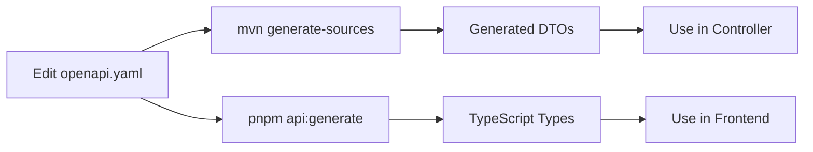

# OpenAPI Contract-First Quick Reference

> **TL;DR:** Edit `openapi.yaml` → Run `mvn generate-sources` → Use generated DTOs in your code

---

## 🚀 Quick Commands

```bash
# Generate Java DTOs from OpenAPI spec
mvn generate-sources

# Full build (DTOs + JOOQ + compile)
mvn clean install

# Validate OpenAPI spec
npx @apidevtools/swagger-cli validate openapi.yaml

# Generate TypeScript types (Frontend)
pnpm api:generate
```

---

## 📁 File Locations

| What | Where |
|------|-------|
| **OpenAPI Spec** | `openapi.yaml` |
| **Generated Java DTOs** | `target/generated-sources/openapi/.../dto/generated/` |
| **Manual DTOs** | `src/main/java/.../dto/request/` & `.../dto/response/` |
| **Frontend TypeScript** | `<frontend>/src/generated/api.ts` |

---

## ✅ Workflow



### Step-by-Step

1. **Define schema** in `openapi.yaml`
2. **Generate code**: `mvn generate-sources`
3. **Import DTO**: `import com.Flyway.server.dto.generated.*;`
4. **Use in controller**: `public UserResponse create(@Valid @RequestBody CreateUserRequest req)`

---

## 🔧 OpenAPI Schema Template

```yaml
components:
  schemas:
    # Request DTO
    CreateUserRequest:
      type: object
      description: Request to create a user
      required: [email, firstName, lastName]
      properties:
        email:
          type: string
          format: email
          description: User's email
        firstName:
          type: string
          minLength: 1
          maxLength: 100
        lastName:
          type: string
          minLength: 1
          maxLength: 100
    
    # Response DTO
    UserResponse:
      type: object
      description: User information
      required: [id, email, firstName, lastName, createdAt]
      properties:
        id:
          type: integer
          format: int64
        email:
          type: string
          format: email
        firstName:
          type: string
        lastName:
          type: string
        organizationId:
          type: integer
          format: int64
          nullable: true
        createdAt:
          type: string
          format: date-time
    
    # Enum
    UserStatusEnum:
      type: string
      enum: [active, inactive, suspended]
      description: User account status
    
    # Error Response
    ErrorResponse:
      type: object
      required: [error, message, timestamp]
      properties:
        error:
          type: string
        message:
          type: string
        timestamp:
          type: string
          format: date-time
  
  responses:
    NotFoundError:
      description: Resource not found
      content:
        application/json:
          schema:
            $ref: '#/components/schemas/ErrorResponse'

paths:
  /users:
    post:
      operationId: createUser
      summary: Create a new user
      tags: [Users]
      requestBody:
        required: true
        content:
          application/json:
            schema:
              $ref: '#/components/schemas/CreateUserRequest'
      responses:
        '201':
          description: User created
          content:
            application/json:
              schema:
                $ref: '#/components/schemas/UserResponse'
        '400':
          $ref: '#/components/responses/ValidationError'
```

---

## 💻 Controller Code Template

```java
@RestController
@RequestMapping("/api/users")
@RequiredArgsConstructor
public class UserController {
    
    private final UserService userService;
    
    @PostMapping
    public ResponseEntity<UserResponse> createUser(
            @Valid @RequestBody CreateUserRequest request) {
        
        UserResponse response = userService.createUser(request);
        return ResponseEntity.status(HttpStatus.CREATED).body(response);
    }
    
    @GetMapping("/{id}")
    public ResponseEntity<UserResponse> getUser(@PathVariable Long id) {
        UserResponse response = userService.getUser(id);
        return ResponseEntity.ok(response);
    }
    
    @PutMapping("/{id}")
    public ResponseEntity<UserResponse> updateUser(
            @PathVariable Long id,
            @Valid @RequestBody UpdateUserRequest request) {
        
        UserResponse response = userService.updateUser(id, request);
        return ResponseEntity.ok(response);
    }
    
    @DeleteMapping("/{id}")
    public ResponseEntity<Void> deleteUser(@PathVariable Long id) {
        userService.deleteUser(id);
        return ResponseEntity.noContent().build();
    }
}
```

---

## 🔄 Mapper Template

```java
@Component
public class DtoMapper {
    
    public UserResponse toUserResponse(UsersRecord record) {
        return UserResponse.builder()
                .id(record.getId())
                .email(record.getEmail())
                .firstName(record.getFirstName())
                .lastName(record.getLastName())
                .organizationId(record.getOrganizationId())
                .createdAt(record.getCreatedAt())
                .updatedAt(record.getUpdatedAt())
                .build();
    }
    
    public UsersRecord toUsersRecord(CreateUserRequest request) {
        UsersRecord record = new UsersRecord();
        record.setEmail(request.getEmail());
        record.setFirstName(request.getFirstName());
        record.setLastName(request.getLastName());
        return record;
    }
}
```

---

## 📋 OpenAPI Schema Rules

### ✅ DO:

- Define all schemas in `components/schemas`
- Use PascalCase for schema names: `UserResponse`, `CreateUserRequest`
- Use camelCase for property names: `firstName`, `createdAt`
- Add `description` to all schemas and properties
- Use `required` array for mandatory fields
- Separate Request/Response schemas
- Use enums for fixed value sets
- Add `operationId` to all endpoints
- Use `format` for types: `email`, `date-time`, `uri`, `uuid`

### ❌ DON'T:

- Don't define schemas inline in paths
- Don't use generic names: `Request`, `Response`, `Data`
- Don't make everything nullable "to be safe"
- Don't skip descriptions
- Don't edit generated code (in `dto/generated/`)
- Don't use snake_case for properties

---

## 🎯 Required vs Optional & Nullable

| Type | OpenAPI | Java | TypeScript |
|------|---------|------|------------|
| **Required, not null** | `required: ["field"]` | `@NotNull field` | `field: string` |
| **Required, nullable** | `required: ["field"]`<br/>`nullable: true` | `@NotNull field` (can be null) | `field: string \| null` |
| **Optional, not null** | Not in `required` | `field` | `field?: string` |
| **Optional, nullable** | Not in `required`<br/>`nullable: true` | `field` | `field?: string \| null` |

---

## 🔍 Generated DTO Features

Generated Java DTOs include:

✅ **Lombok** - `@Data`, `@Builder`, `@NoArgsConstructor`, `@AllArgsConstructor`  
✅ **Validation** - `@NotNull`, `@Size`, `@Email`, `@Min`, `@Max`  
✅ **Jackson** - `@JsonProperty` for JSON serialization  
✅ **Swagger** - `@Schema` for documentation  
✅ **JavaDoc** - From OpenAPI descriptions  

---

## 🛠️ Maven Configuration

The `pom.xml` includes:

```xml
<!-- OpenAPI Generator Plugin -->
<plugin>
    <groupId>org.openapitools</groupId>
    <artifactId>openapi-generator-maven-plugin</artifactId>
    <version>7.2.0</version>
    <configuration>
        <inputSpec>${project.basedir}/openapi.yaml</inputSpec>
        <generatorName>spring</generatorName>
        <modelPackage>com.Flyway.server.dto.generated</modelPackage>
        <generateModels>true</generateModels>
        <generateApis>false</generateApis>
        <configOptions>
            <useLombok>true</useLombok>
            <useBeanValidation>true</useBeanValidation>
        </configOptions>
    </configuration>
</plugin>
```

---

## 🌐 Frontend Integration

### Generate TypeScript Types

```bash
# Option 1: From local file
npx swagger-typescript-api -p ./openapi.yaml -o ./src/generated -n api.ts --axios --generate-union-enums

# Option 2: From running backend
npx swagger-typescript-api -p http://localhost:8080/openapi.yaml -o ./src/generated -n api.ts --axios --generate-union-enums
```

### Use in Frontend

```typescript
import { api, CreateUserRequest, UserResponse } from './generated/api';

// Type-safe request
const request: CreateUserRequest = {
  email: "user@example.com",
  firstName: "John",
  lastName: "Doe"
};

// Type-safe response
const response: UserResponse = await api.createUser(request);
console.log(response.id); // ✅ TypeScript knows this is a number
```

---

## 🐛 Troubleshooting

### Generated DTOs not found

```bash
mvn clean generate-sources
# Then reload Maven project in IDE (IntelliJ: Ctrl+Shift+O / Cmd+Shift+I)
```

### Validation not working

Ensure `@Valid` annotation is present:
```java
public ResponseEntity<UserResponse> create(
    @Valid @RequestBody CreateUserRequest request) // ✅ @Valid is required
```

### Types out of sync

Both frontend and backend should regenerate from same OpenAPI spec:
```bash
# Backend
mvn generate-sources

# Frontend  
pnpm api:generate
```

---

## 📚 Documentation

| Document | Purpose |
|----------|---------|
| [OPENAPI_WORKFLOW.md](./OPENAPI_WORKFLOW.md) | Complete workflow guide |
| [EXAMPLE_USAGE.md](./EXAMPLE_USAGE.md) | Code examples |
| [swagger-ts.md](./swagger-ts.md) | OpenAPI best practices |
| [README.md](./README.md) | Project documentation |

---

## 🎓 Key Concepts

### Contract-First Development

1. **Define** API contract in OpenAPI spec
2. **Generate** DTOs for backend (Java) and frontend (TypeScript)
3. **Implement** business logic using generated types
4. **Test** with type safety guaranteed

### Benefits

✅ **Single source of truth** - One spec, multiple consumers  
✅ **Type safety** - Frontend and backend share same contract  
✅ **Auto validation** - Constraints from spec become bean validation  
✅ **Always in sync** - Can't have mismatched types  
✅ **Better DX** - Auto-complete and IntelliSense everywhere  

---

## 🔗 External Resources

- [OpenAPI 3.0 Spec](https://swagger.io/specification/)
- [OpenAPI Generator](https://openapi-generator.tech/)
- [Swagger Editor](https://editor.swagger.io/) - Validate specs online
- [Bean Validation](https://beanvalidation.org/)

---

**Last Updated:** October 2025  
**Version:** 1.0.0

