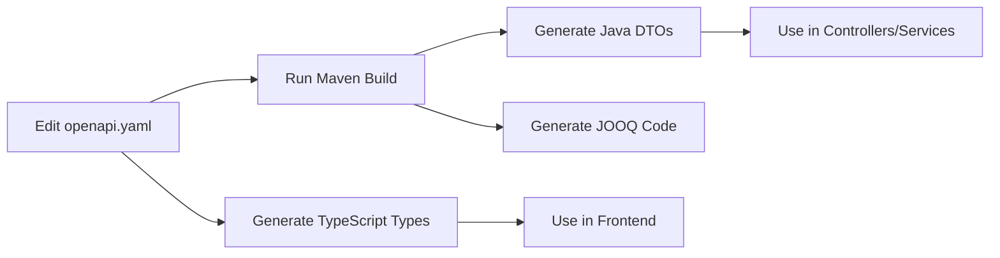

# OpenAPI Contract-First Development Workflow

This document explains how to use OpenAPI as the **single source of truth** for both frontend TypeScript types and backend Java DTOs.

## 📋 Table of Contents
1. [Overview](#overview)
2. [Workflow](#workflow)
3. [Setup](#setup)
4. [Usage](#usage)
5. [Best Practices](#best-practices)
6. [Generated Code](#generated-code)
7. [Migration from Manual DTOs](#migration-from-manual-dtos)

---

## Overview

We use **Contract-First** development where:

1. ✅ **OpenAPI spec** (`openapi.yaml`) is the single source of truth
2. ✅ **Java DTOs** are auto-generated from OpenAPI spec
3. ✅ **TypeScript types** are auto-generated from OpenAPI spec
4. ✅ All schemas follow the best practices from `swagger-ts.md`

### Why Contract-First?

✅ **No duplication** - Define schemas once, use everywhere

✅ **Type safety** - Frontend and backend share the same contract

✅ **Auto validation** - Bean Validation annotations generated automatically

✅ **Always in sync** - Can't have mismatched types between frontend/backend

✅ **Documentation** - OpenAPI spec serves as living documentation

---

## Workflow



### Step-by-Step Process

1. **Define/Update API Contract** in `openapi.yaml`
   - Follow best practices from `swagger-ts.md`
   - Define all schemas in `components/schemas`
   - Use proper naming conventions (Request/Response suffixes)

2. **Generate Java Code**
   ```bash
   mvn clean generate-sources
   ```
   - Generates DTOs in `target/generated-sources/openapi/src/main/java/com/Flyway/Flyway/dto/generated/`
   - Also runs Flyway migrations and JOOQ generation

3. **Generate TypeScript Types** (Frontend)
   ```bash
   # In your frontend project
   pnpm api:generate
   ```

4. **Use Generated Code** in your application

---

## Setup

### Backend (Already Configured)

The Maven build is already configured with:

1. **OpenAPI Generator Plugin** - Generates Java DTOs
2. **Flyway Plugin** - Manages database migrations
3. **JOOQ Plugin** - Generates database access code

Dependencies added:
- `jackson-databind-nullable` - For nullable fields
- `swagger-annotations` - For OpenAPI annotations

### Frontend Setup (To Do)

Add to your frontend's `package.json`:

```json
{
  "scripts": {
    "api:generate": "npx swagger-typescript-api -p http://localhost:8080/openapi.yaml -o ./src/generated -n api.ts --axios --generate-union-enums"
  }
}
```

Or fetch from your backend after serving the OpenAPI spec as a static resource.

---

## Usage

### 1. Defining Schemas in OpenAPI

**✅ CORRECT - Follow swagger-ts.md best practices:**

```yaml
components:
  schemas:
    # Define enums separately
    UserStatusEnum:
      type: string
      enum: [active, inactive, pending, suspended]
      description: User account status
    
    # Request schemas
    CreateUserRequest:
      type: object
      description: Request to create a new user
      required:
        - email
        - firstName
        - lastName
      properties:
        email:
          type: string
          format: email
          description: User's email address
        firstName:
          type: string
          minLength: 1
          maxLength: 100
          description: User's first name
        lastName:
          type: string
          minLength: 1
          maxLength: 100
          description: User's last name
    
    # Response schemas
    UserResponse:
      type: object
      description: User information
      required:
        - id
        - email
        - firstName
        - lastName
        - status
        - createdAt
      properties:
        id:
          type: integer
          format: int64
          description: User ID
        email:
          type: string
          format: email
          description: User's email address
        firstName:
          type: string
          description: User's first name
        lastName:
          type: string
          description: User's last name
        status:
          $ref: '#/components/schemas/UserStatusEnum'
        organizationId:
          type: integer
          format: int64
          nullable: true
          description: Organization ID (null if not in organization)
        createdAt:
          type: string
          format: date-time
          description: When the user was created
        updatedAt:
          type: string
          format: date-time
          description: When the user was last updated

  responses:
    NotFoundError:
      description: Resource not found
      content:
        application/json:
          schema:
            $ref: '#/components/schemas/ErrorResponse'

paths:
  /users:
    post:
      operationId: createUser
      summary: Create a new user
      tags:
        - Users
      requestBody:
        required: true
        content:
          application/json:
            schema:
              $ref: '#/components/schemas/CreateUserRequest'
      responses:
        '201':
          description: User created successfully
          content:
            application/json:
              schema:
                $ref: '#/components/schemas/UserResponse'
        '400':
          $ref: '#/components/responses/ValidationError'
```

### 2. Generating Code

**Generate Java DTOs:**
```bash
# Just the DTOs
mvn generate-sources

# Or full build
mvn clean install
```

Generated DTOs will be at:
```
target/generated-sources/openapi/src/main/java/com/Flyway/Flyway/dto/generated/
├── CreateUserRequest.java
├── UserResponse.java
├── UserStatusEnum.java
└── ...
```

### 3. Using Generated DTOs in Controllers

```java
package com.Flyway.Flyway.controller;

import com.Flyway.Flyway.dto.generated.*;
import org.springframework.web.bind.annotation.*;
import jakarta.validation.Valid;

@RestController
@RequestMapping("/users")
public class UserController {
    
    @PostMapping
    public UserResponse createUser(@Valid @RequestBody CreateUserRequest request) {
        // Use the generated DTO
        // Bean validation (@Valid) uses constraints from OpenAPI spec
        return userService.createUser(request);
    }
    
    @GetMapping("/{id}")
    public UserResponse getUser(@PathVariable Long id) {
        return userService.getUser(id);
    }
}
```

### 4. Generated Java DTO Example

From the OpenAPI spec above, this Java class is generated:

```java
package com.Flyway.Flyway.dto.generated;

import com.fasterxml.jackson.annotation.JsonProperty;
import io.swagger.v3.oas.annotations.media.Schema;
import jakarta.validation.constraints.*;
import lombok.Data;
import lombok.Builder;
import lombok.NoArgsConstructor;
import lombok.AllArgsConstructor;

import java.time.OffsetDateTime;

/**
 * User information
 */
@Data
@Builder
@NoArgsConstructor
@AllArgsConstructor
@Schema(description = "User information")
public class UserResponse {

    @JsonProperty("id")
    @NotNull
    @Schema(description = "User ID", required = true)
    private Long id;

    @JsonProperty("email")
    @NotNull
    @Email
    @Schema(description = "User's email address", required = true)
    private String email;

    @JsonProperty("firstName")
    @NotNull
    @Size(min = 1, max = 100)
    @Schema(description = "User's first name", required = true)
    private String firstName;

    @JsonProperty("lastName")
    @NotNull
    @Size(min = 1, max = 100)
    @Schema(description = "User's last name", required = true)
    private String lastName;

    @JsonProperty("status")
    @NotNull
    @Schema(description = "User account status", required = true)
    private UserStatusEnum status;

    @JsonProperty("organizationId")
    @Schema(description = "Organization ID (null if not in organization)")
    private Long organizationId;

    @JsonProperty("createdAt")
    @NotNull
    @Schema(description = "When the user was created", required = true)
    private OffsetDateTime createdAt;

    @JsonProperty("updatedAt")
    @Schema(description = "When the user was last updated")
    private OffsetDateTime updatedAt;
}
```

### 5. Using TypeScript Types (Frontend)

```typescript
import { api, CreateUserRequest, UserResponse } from './generated/api';

// Type-safe request
const request: CreateUserRequest = {
  email: "user@example.com",
  firstName: "John",
  lastName: "Doe"
};

// Type-safe response
const response: UserResponse = await api.createUser(request);

console.log(response.id); // ✅ TypeScript knows this is a number
console.log(response.email); // ✅ TypeScript knows this is a string
```

---

## Generated Code

### Java DTOs Features

Generated DTOs include:

✅ **Lombok annotations** (`@Data`, `@Builder`, `@NoArgsConstructor`, `@AllArgsConstructor`)

✅ **Bean Validation** (`@NotNull`, `@Size`, `@Email`, `@Min`, `@Max`)

✅ **Jackson annotations** (`@JsonProperty`) for JSON serialization

✅ **Swagger annotations** (`@Schema`) for documentation

✅ **JavaDoc comments** from OpenAPI descriptions

### Package Structure

```
src/main/java/com/Flyway/Flyway/dto/
├── generated/              # ✅ AUTO-GENERATED - Do not edit!
│   ├── CreateUserRequest.java
│   ├── UpdateUserRequest.java
│   ├── UserResponse.java
│   ├── UserStatusEnum.java
│   └── ...
└── custom/                 # ✅ Manual DTOs (if needed)
    └── CustomDTO.java      # DTOs not in OpenAPI spec
```

---

## Best Practices

### 1. ✅ Always Define Schemas in OpenAPI First

**Before writing code:**
1. Define schema in `openapi.yaml`
2. Run code generation
3. Use generated code

### 2. ✅ Follow swagger-ts.md Guidelines

Key rules from `swagger-ts.md`:

- ✅ Define all schemas in `components/schemas` (not inline)
- ✅ Use PascalCase for schema names
- ✅ Use camelCase for property names
- ✅ Add descriptions to all schemas and properties
- ✅ Use `required` array for mandatory fields
- ✅ Use `nullable: true` only when needed
- ✅ Separate Request/Response schemas
- ✅ Use enums for fixed value sets
- ✅ Add `operationId` to all endpoints

### 3. ✅ Never Edit Generated Code

```
⚠️ DO NOT EDIT FILES IN dto/generated/
   They will be overwritten on next build!
```

If you need custom logic:
- Create a separate class in `dto/custom/`
- Use composition or inheritance
- Or add to the OpenAPI spec if it should be part of the contract

### 4. ✅ Regenerate After OpenAPI Changes

```bash
# After editing openapi.yaml
mvn clean generate-sources

# This will regenerate:
# - Java DTOs
# - JOOQ code (if DB schema changed)
```

### 5. ✅ Validate OpenAPI Spec

Before committing, validate your spec:

```bash
# Using Swagger CLI
npx @apidevtools/swagger-cli validate openapi.yaml

# Or online
# https://editor.swagger.io/
```

### 6. ✅ Version Your OpenAPI Spec

```yaml
info:
  title: Flyway API
  version: 1.0.0  # Increment when making breaking changes
```

### 7. ⚠️ Required vs Optional & Nullable

Follow the guide in `swagger-ts.md`:

| Use Case | OpenAPI | Java | TypeScript |
|----------|---------|------|------------|
| Always present, never null | `required: ["field"]` | `@NotNull field` | `field: string` |
| Always present, can be null | `required: ["field"]`<br/>`nullable: true` | `@NotNull field` (can be null) | `field: string \| null` |
| Optional, not null | Not in `required` | `field` | `field?: string` |
| Optional, can be null | Not in `required`<br/>`nullable: true` | `field` | `field?: string \| null` |

---

## Migration from Manual DTOs

### Option 1: Gradual Migration (Recommended)

1. Keep existing DTOs in `dto/request/` and `dto/response/`
2. Define new endpoints in OpenAPI
3. Generate new DTOs in `dto/generated/`
4. Gradually migrate endpoints to use generated DTOs
5. Delete manual DTOs once migrated

### Option 2: All at Once

1. Define all endpoints in OpenAPI
2. Generate all DTOs
3. Update all controllers to use generated DTOs
4. Delete old manual DTOs

### Example Migration

**Before (Manual DTO):**
```java
// src/main/java/com/Flyway/Flyway/dto/request/CreateUserRequest.java
public class CreateUserRequest {
    private String email;
    private String firstName;
    private String lastName;
    // ... getters/setters
}
```

**After (Generated from OpenAPI):**
```java
// target/generated-sources/openapi/.../dto/generated/CreateUserRequest.java
@Data
@Builder
public class CreateUserRequest {
    @NotNull @Email
    private String email;
    
    @NotNull @Size(min = 1, max = 100)
    private String firstName;
    
    @NotNull @Size(min = 1, max = 100)
    private String lastName;
}
```

**Update Controller:**
```java
// Change import
// import com.Flyway.Flyway.dto.request.CreateUserRequest;
import com.Flyway.Flyway.dto.generated.CreateUserRequest;

// No other changes needed!
@PostMapping
public UserResponse createUser(@Valid @RequestBody CreateUserRequest request) {
    return userService.createUser(request);
}
```

---

## Serving OpenAPI Spec to Frontend

To allow frontend to fetch the OpenAPI spec:

### Option 1: Copy openapi.yaml to static resources

```bash
# Add to your build
cp openapi.yaml src/main/resources/static/
```

Frontend can fetch from:
```
http://localhost:8080/openapi.yaml
```

### Option 2: Use Springdoc (OpenAPI UI)

Add dependency:
```xml
<dependency>
    <groupId>org.springdoc</groupId>
    <artifactId>springdoc-openapi-starter-webmvc-ui</artifactId>
    <version>2.3.0</version>
</dependency>
```

Then access at:
- Swagger UI: `http://localhost:8080/swagger-ui.html`
- OpenAPI JSON: `http://localhost:8080/v3/api-docs`

---

## Troubleshooting

### Generated DTOs not found

**Problem:** Import errors for generated DTOs

**Solution:**
```bash
mvn clean generate-sources
# Then reload Maven project in IDE
```

### Validation not working

**Problem:** Bean validation annotations ignored

**Solution:** Ensure you have `@Valid` in controller:
```java
@PostMapping
public UserResponse create(@Valid @RequestBody CreateUserRequest request) {
    // ...
}
```

### TypeScript types out of sync

**Problem:** Frontend types don't match backend

**Solution:** Both should regenerate from the same OpenAPI spec:
```bash
# Backend
mvn generate-sources

# Frontend
pnpm api:generate
```

---

## Quick Reference

### Commands

```bash
# Generate Java DTOs
mvn generate-sources

# Full build (DTOs + JOOQ + compile)
mvn clean install

# Validate OpenAPI spec
npx @apidevtools/swagger-cli validate openapi.yaml

# Generate TypeScript types (Frontend)
pnpm api:generate
```

### File Locations

| File | Location |
|------|----------|
| OpenAPI Spec | `openapi.yaml` |
| Generated Java DTOs | `target/generated-sources/openapi/src/main/java/com/Flyway/Flyway/dto/generated/` |
| Manual DTOs | `src/main/java/com/Flyway/Flyway/dto/custom/` |
| Generated TypeScript | `<frontend>/src/generated/api.ts` |

### Key Rules

✅ **DO:**
- Define schemas in OpenAPI first
- Follow swagger-ts.md best practices
- Use generated DTOs in controllers
- Add descriptions to all schemas
- Use `required` and `nullable` correctly

❌ **DON'T:**
- Edit generated code
- Define schemas inline in paths
- Use generic names (Request, Response, Data)
- Make everything nullable "to be safe"

---

## Additional Resources

- [swagger-ts.md](./swagger-ts.md) - Complete best practices guide
- [OpenAPI 3.0 Spec](https://swagger.io/specification/)
- [OpenAPI Generator Docs](https://openapi-generator.tech/)
- [Swagger Editor](https://editor.swagger.io/) - Validate and visualize OpenAPI specs

---

**Last Updated:** October 2025
**Maintained by:** Backend Team

